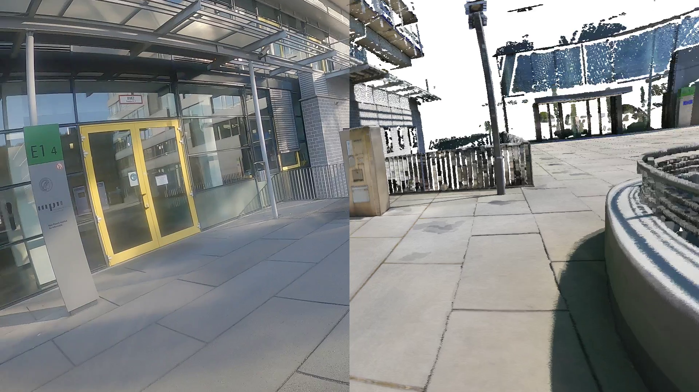

# HPS Dataset demo scripts
Python scripts for demo/visualization of various data from HPS Dataset

## Requirements
- GPU with OpenGL 4.0 and EGL support
- ffmpeg>=2.1 with libx264 enabled and ffprobe installed

## Installation
1. `git clone https://github.com/vguzov/hps_dataset_scripts`
2. `pip install -r requirements.txt`
3. Get the SMPL model: Follow install instructions on https://github.com/gulvarol/smplpytorch

## Sample 1: visualize camera self-localization results
- Download localization results and scans from http://virtualhumans.mpi-inf.mpg.de/hps/
- Keep the scans packed
- Choose the virtual camera calibration: there are 2 choices, 
  029756 or 029757, which represents calibrations from real cameras with S/N 029756 and 029757. 
  These cameras were used during the data capturing process.
- (Optional) To render split screen view, download and unpack camera videos

Run `python render_visual_localization.py <path to localization json> <path to appopriate scan zip> <output mp4> --camera <choose 029756 or 029757>`
(to render split screen, pass `-iv <path to appropriate video>`)

Sample result (with split screen rendering):
<p align="center">

</p>

## Sample 2: render a moving SMPL model inside a 3D scene scan
- Go to https://github.com/vguzov/cloudrender
- Follow install instructions
- Run `download_test_assets.sh` and `test_scene_video.py` from there

In `test_assets/output.mp4` you should get the video similar to this one:
<p align="center">

</p>

## Citation

If you find the code or data useful, please cite: 

```
@inproceedings{HPS,
    title = {Human POSEitioning System (HPS): 3D Human Pose Estimation and Self-localization in Large Scenes from Body-Mounted Sensors },
    author = {Guzov, Vladimir and Mir, Aymen and Sattler, Torsten and Pons-Moll, Gerard},
    booktitle = {{IEEE} Conference on Computer Vision and Pattern Recognition (CVPR)},
    month = {jun},
    organization = {{IEEE}},
    year = {2021},
}
```